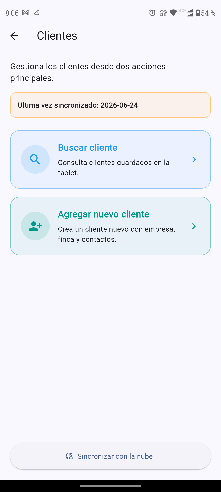
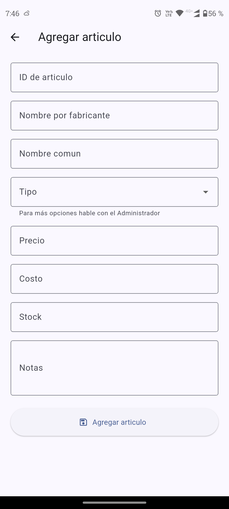
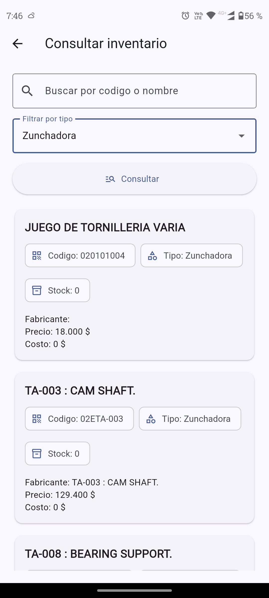

# EliAPP

Aplicación móvil desarrollada en Flutter para digitalizar procesos operativos de mantenimiento, inventario, clientes y órdenes de trabajo en entornos con conectividad intermitente.

## Overview

EliAPP fue diseñada como una solución interna para optimizar el trabajo técnico en campo y centralizar procesos que antes dependían de registros manuales, archivos dispersos y conexión constante a internet.

La aplicación permite operar desde tablets, almacenar información localmente cuando no hay red y sincronizar los datos posteriormente con Google Sheets y Google Drive.

## Core Capabilities

- Registro de horarios de entrada y salida
- Gestión y consulta de clientes
- Control de inventario con búsqueda local
- Creación de artículos de inventario
- Registros de mantenimiento con fotos y firmas
- Generación de formatos técnicos en Excel
- Órdenes de mantenimiento
- Órdenes de pedido
- Sincronización automática y manual con la nube
- Operación offline con base de datos local

## Technical Stack

- Flutter
- Dart
- SQLite
- Google Apps Script
- Google Sheets
- Google Drive
- HTTP APIs
- Generación y edición de archivos Excel

## Architecture Highlights

### Offline-first workflow
La aplicación fue pensada para seguir funcionando aun cuando no haya conexión a internet. Clientes, inventario y distintos registros pueden consultarse o crearse localmente, y sincronizarse después.

### Local persistence
Se implementó almacenamiento local con SQLite para mantener disponible la información crítica en el dispositivo.

### Cloud synchronization
La sincronización se realiza mediante servicios conectados a Google Apps Script, que actúa como capa intermedia para interactuar con Google Sheets y Google Drive.

### Operational forms
Los formularios técnicos fueron adaptados al flujo real del trabajo de mantenimiento, incluyendo evidencia fotográfica, firmas y trazabilidad documental.

## Main Modules

### Horarios
Permite registrar entradas y salidas del personal, almacenando la información en la nube para control operativo.

### Clientes
Incluye consulta local de clientes, creación de nuevos registros y sincronización con Google Sheets.

### Inventario
Permite consultar inventario desde la nube o desde copia local, además de registrar nuevos artículos y mantener sincronización de stock y catálogo.

### Registros de mantenimiento
Módulo técnico principal para documentar mantenimientos preventivos o correctivos con:
- datos del cliente
- descripción del equipo
- protocolo de mantenimiento
- piezas cambiadas
- observaciones
- fotografías
- firmas
- exportación a formato Excel

### Histórico de mantenimiento
Consulta de mantenimientos previamente registrados desde la hoja histórica.

### Órdenes de mantenimiento
Creación y actualización de órdenes de trabajo para seguimiento operativo.

### Órdenes de pedido
Creación y actualización de pedidos relacionados con materiales o requerimientos del cliente.

## Key Technical Challenges Solved

- Implementación de trabajo offline en tablets de campo
- Sincronización de datos locales con servicios en la nube
- Generación de archivos Excel desde la app sin perder estructura base
- Captura y procesamiento de firmas dentro del flujo móvil
- Integración de fotografías en registros técnicos
- Validación por roles de usuario
- Integración de procesos reales de mantenimiento en una interfaz móvil simple

## My Contribution

Participé en el diseño e implementación de módulos clave de la aplicación, incluyendo:

- arquitectura offline-first
- persistencia local con SQLite
- sincronización con Google Sheets y Drive
- formularios técnicos de mantenimiento
- generación de registros en Excel
- captura de firmas e imágenes
- gestión de clientes e inventario
- órdenes de mantenimiento y de pedido
- mejoras de estabilidad y corrección de errores

## Screens

### Login
Pantalla de autenticación de usuarios para controlar acceso según rol.

### Home
Pantalla principal desde la que se accede a todos los módulos operativos de la aplicación.

### Clientes
Consulta local de clientes registrados para trabajo rápido incluso sin conexión.

### Inventario
Vista principal del módulo de inventario con accesos a búsqueda, consulta local y creación de artículos.

### Agregar inventario
Formulario para registrar nuevos artículos dentro del sistema.

### Buscar inventario
Pantalla de consulta de inventario con filtros para localizar artículos rápidamente.

### Órdenes
Pantalla de acceso a la gestión de órdenes de mantenimiento y pedidos.

## Services and Integrations

### SQLite local database
Se usa para conservar inventario, clientes, usuarios y otros datos necesarios para operar sin conexión.

### Google Apps Script
Funciona como backend ligero para recibir, transformar y registrar la información en Google Sheets y Google Drive.

### Google Sheets
Se utiliza como base operativa para clientes, inventario, históricos y órdenes.

### Google Drive
Se utiliza para almacenar documentos generados y archivos asociados a registros de mantenimiento.

## Why This Project Matters

EliAPP no es solo una app administrativa; es una herramienta pensada para resolver necesidades operativas reales en campo, reducir fricción en el registro de información y mejorar la trazabilidad del mantenimiento.

## Privacy Note

El código fuente de este proyecto no es público, ya que corresponde a una solución interna de uso operativo.
