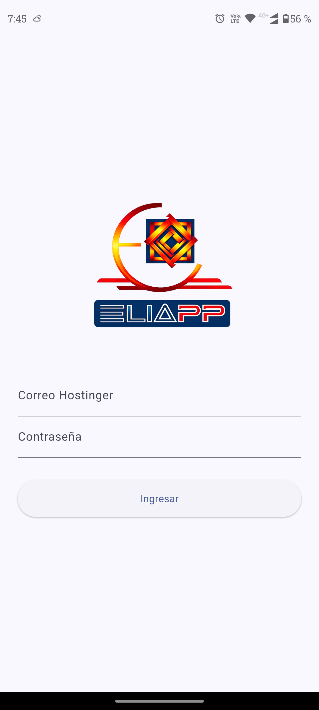
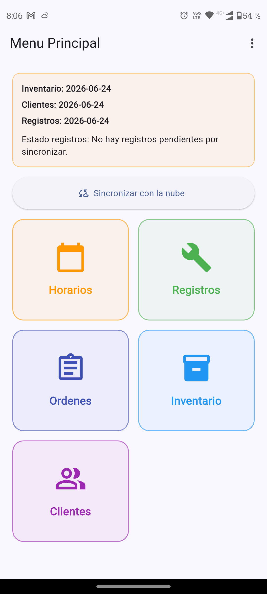
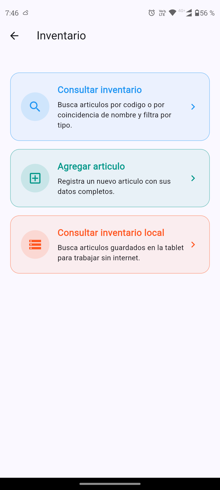
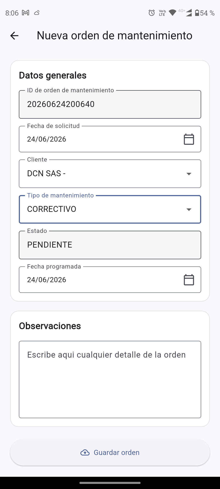
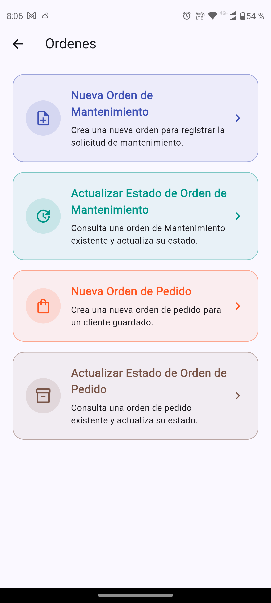

# EliAPP

Aplicación móvil desarrollada en Flutter para digitalizar procesos de mantenimiento, inventario, clientes, horarios y órdenes de trabajo en entornos con conectividad intermitente.

## Resumen

EliAPP fue diseñada como una herramienta de uso interno para mejorar la organización, trazabilidad y velocidad de trabajo en operaciones técnicas y de mantenimiento.

La aplicación permite registrar información crítica desde tabletas, incluso sin conexión a internet, y sincronizarla posteriormente con Google Sheets y Google Drive.

## Funcionalidades principales

- Registro de horarios de entrada y salida
- Gestión y consulta de clientes
- Control de inventario
- Registros de mantenimiento con fotos y firmas
- Trabajo offline con almacenamiento local
- Sincronización automática cuando vuelve la conexión
- Órdenes de mantenimiento
- Órdenes de pedido
- Histórico de mantenimientos

## Stack tecnológico

- Flutter
- Dart
- SQLite
- Google Apps Script
- Google Sheets
- Google Drive
- HTTP APIs

## Retos técnicos resueltos

- Implementación de modo offline para uso en campo
- Sincronización entre almacenamiento local y la nube
- Generación de archivos Excel desde la aplicación
- Captura de firmas e imágenes dentro de formularios técnicos
- Control de acceso por roles
- Integración de flujos operativos reales dentro de una app móvil

## Mi aporte

Desarrollo e integración de módulos clave de la aplicación, incluyendo:

- lógica de operación offline
- sincronización con Google Sheets y Drive
- formularios técnicos de mantenimiento
- registros con firmas, fotos y exportación
- gestión de clientes e inventario
- órdenes de mantenimiento y pedidos
- mejoras de estabilidad y corrección de errores

## Capturas

### Inicio de sesión

### Pantalla principal

### Inventario

### Registro de mantenimiento

### Órdenes

## Nota de privacidad

El código fuente de este proyecto no es público, ya que corresponde a una solución interna de uso operativo.
